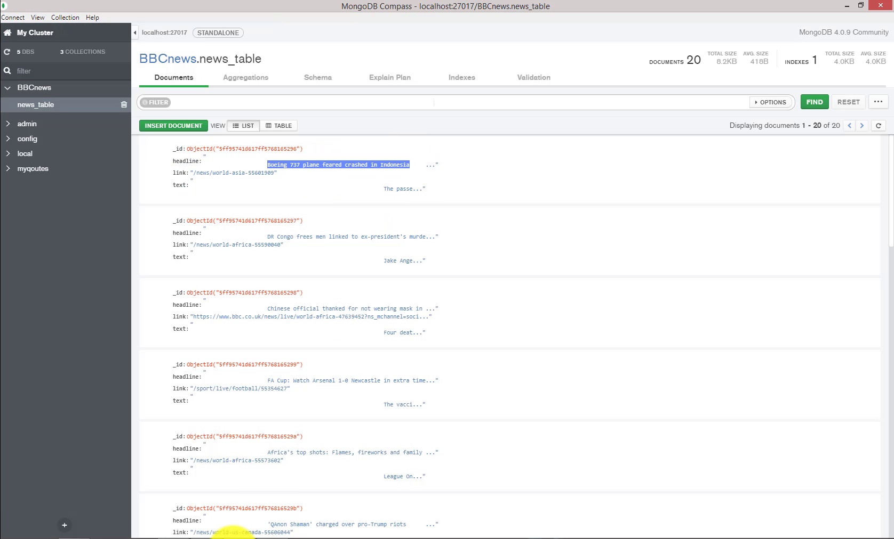

# BBC-news-scraper
News Content Collect and Store That crawl articles on a news website bbc.com using a crawler framework Scrapy.  
## project details
This project is done inspiring by a coding challenge called Data Engineer Coding Challenge.
The project demonstrates how to use Scrapy, a web crawling framework, to crawl a news website, store the data into Mongodb and retrieve data through API.


## Dependencies 

* Python 3.7
* pymongoo
* scrapy


## Execution steps
1- execute the run ```activate.bat```.  
2- execute command ```cd bbctest```.  
3- execute command ```scrapy crawl bbcteest```.  

## screens 


